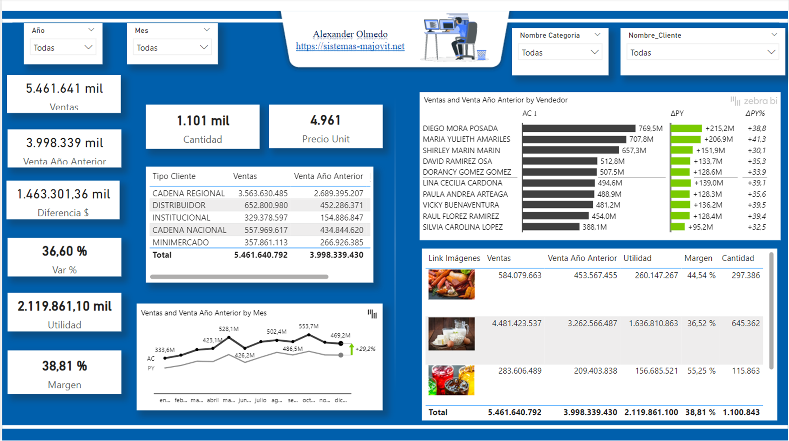

# Informe Financiero

## Explicacion

El proyecto se centrará en crear una visualización dinámica y detallada de un Informe Financiero de una organización utilizando Power BI.
El objetivo principal será proporcionar a los líderes una herramienta efectiva para analizar y comprender el panorama general de la organización e identificar áreas de mejora y tomar decisiones estratégicas para optimizar el rendimiento y la satisfacción de la empresa.

