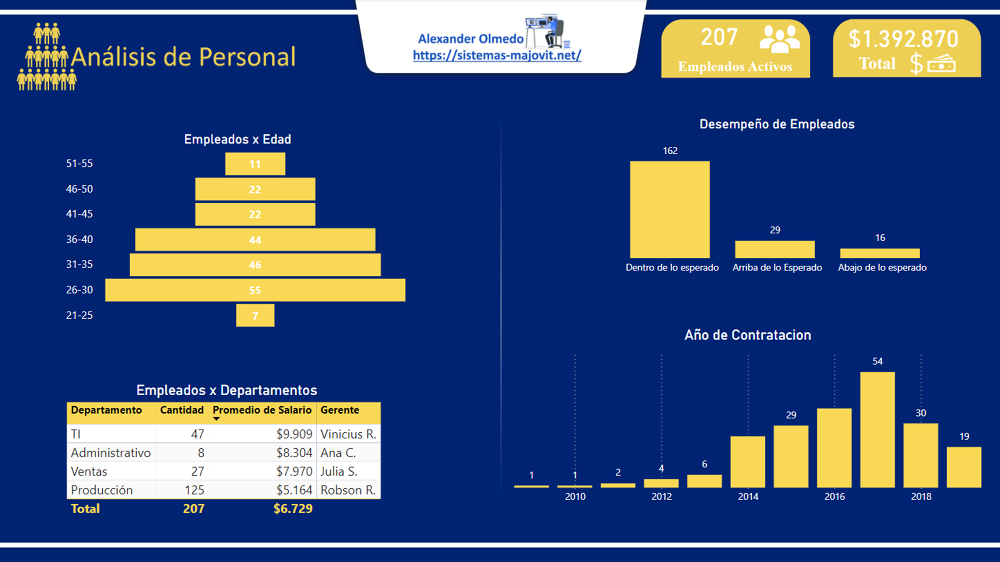
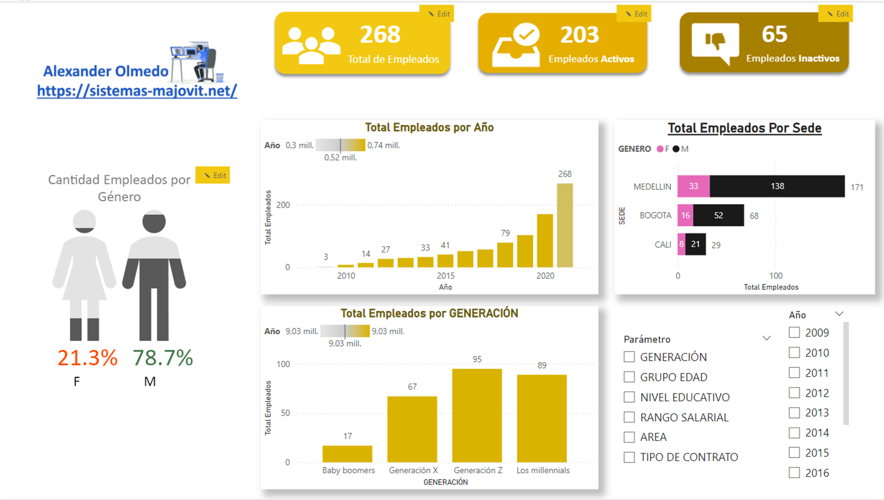

# Informe RRHH

## Explicacion

Los proyectos se centrará en crear una visualización dinámica y detallada de los datos de Informes de Recursos humanos de una organización utilizando Power BI. 
La visualización mostrará información crucial sobre el personal, como la distribución por departamento, la antigüedad, la rotación y el rendimiento.
El objetivo principal será proporcionar a los líderes de recursos humanos y gerentes una herramienta efectiva para analizar y comprender el panorama general del talento de la organización, identificar áreas de mejora y tomar decisiones estratégicas informadas para optimizar el rendimiento y la satisfacción de los empleados. 

 

