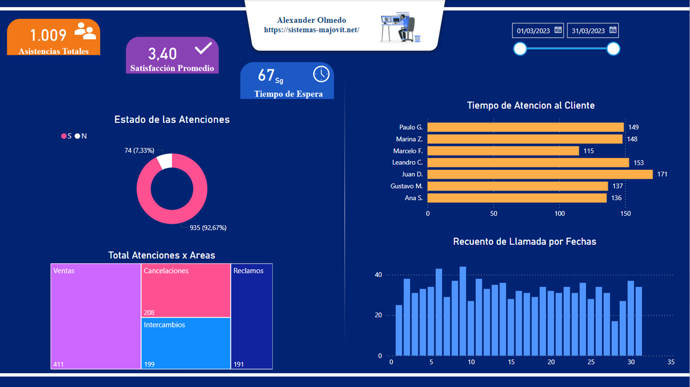

# Informes de Servicio al Cliente

## Explicacion

El proyecto se centrará en crear una visualización dinámica y detallada de los datos de un informe en Servicio al Cliente de una organización utilizando Power BI.
La visualización mostrará información crucial sobre la asistencia total suministrada al cliente y el tiempo de respuesta como la distribución por departamento.
El objetivo principal será proporcionar a los líderes una efectivo panorama para analizar y comprender en general el talento de la organización, identificar áreas de mejora y tomar decisiones estratégicas informadas para optimizar el rendimiento y la satisfacción de los clientes. 

