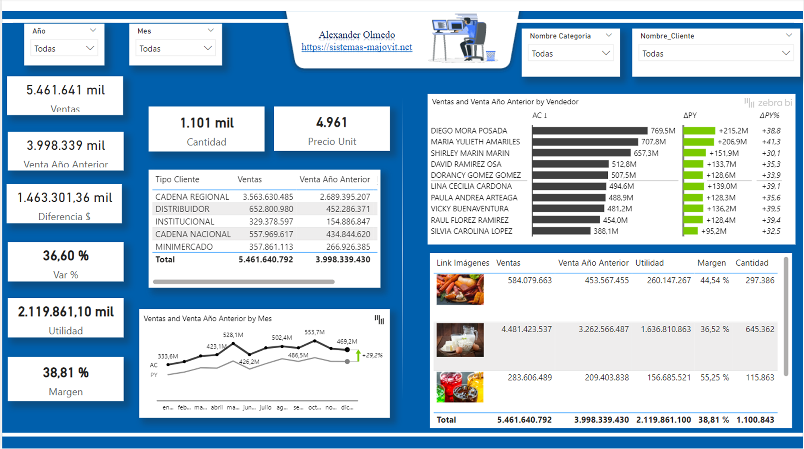
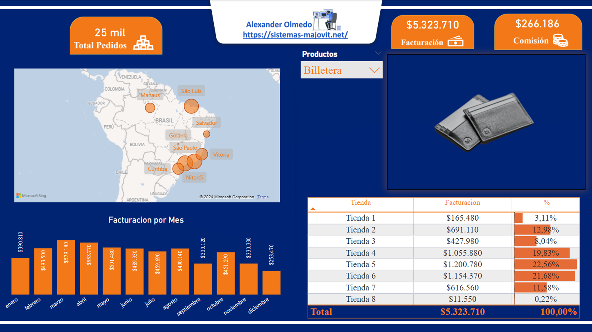

# Informes de Servicio al Cliente

## Explicacion

Los proyectos se centrará en crear una visualización dinámica y detallada en los Informes de Ventas de una organización utilizando Power BI. La visualización mostrará información crucial sobre Ventas, Rentabilidad, Costos, etc. El objetivo principal será proporcionar a los líderes una herramienta efectiva para analizar y comprender el panorama general de la organización, identificar áreas de mejora y tomar decisiones estratégicas informadas para optimizar el rendimiento y la satisfacción de la entidad. 

 

