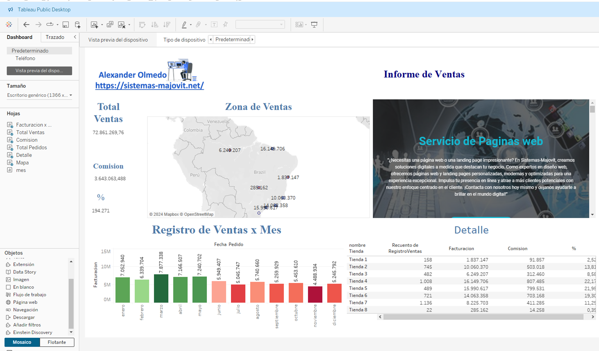

# Informes de Ventas

## Explicacion

El proyecto se centrará en crear una visualización dinámica y detallada de un Informes de Ventas de una organización utilizando la Herramienta Tableau Public. La visualización mostrará información crucial sobre Ventas, Comision, Rentabilidad, etc.
El objetivo principal será proporcionar a los líderes una herramienta efectiva para analizar y comprender el panorama general de la organización e identificar áreas de mejora y tomar decisiones estratégicas informadas para optimizar el rendimiento y la satisfacción de la entidad.

 

 

