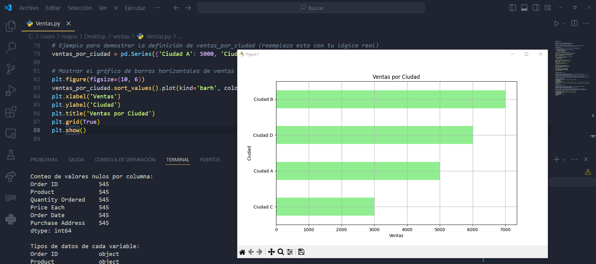
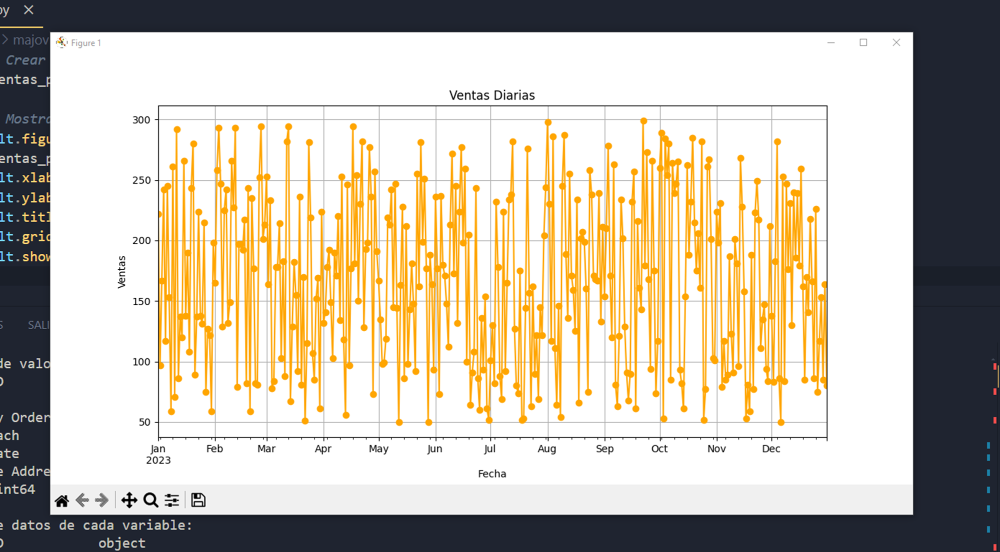
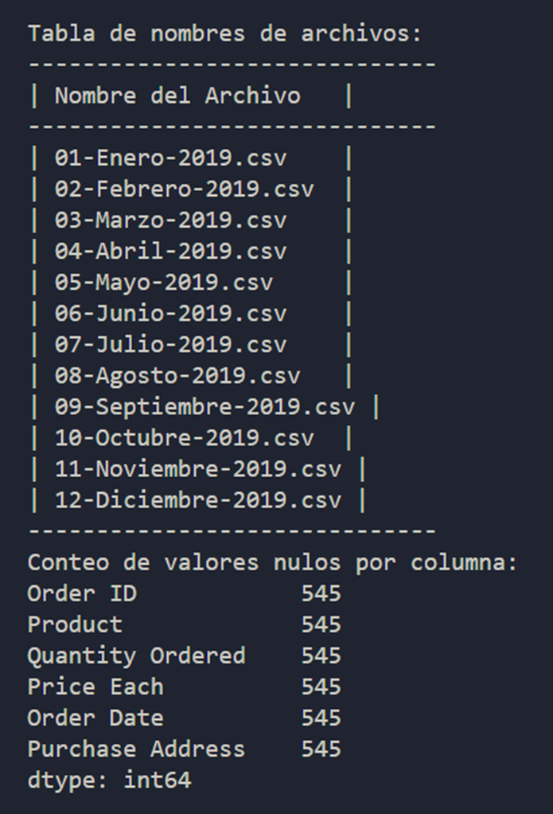

# Informes de Analisis de Datos en Python

## Explicacion
El proyecto se centrará en crear una visualización dinámica y detallada de los datos de un informe de ventas para una organización utilizando Python.
La visualización mostrará información crucial para diferentes tipos de analisis
El objetivo principal será proporcionar a los líderes una efectivo panorama para analizar y comprender diferentes tipos de analisis en general.

 

 

 

 

